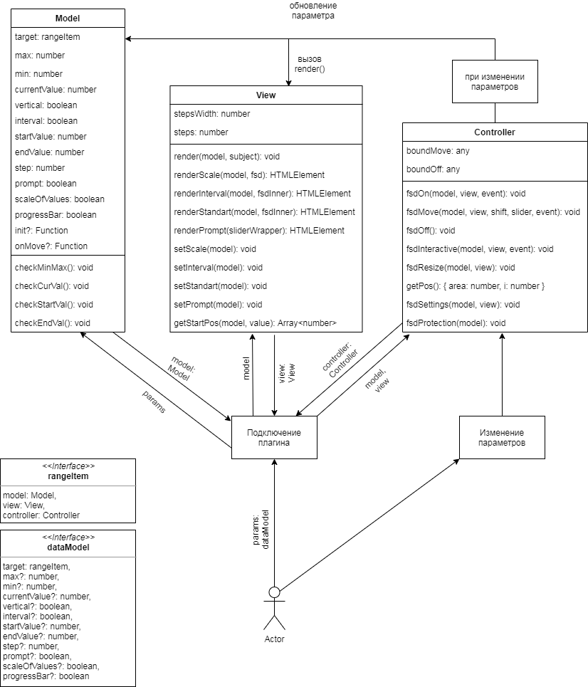

<h1>FSD Range Slider</h1>
<a href="https://vig-dev-fsd.github.io/plugin/">Демо</a>

После скачивания произвести операцию npm i. Команда тестирования: npm test

<h2>Использование</h2>
<pre>
    $('.slider').rangeFSD()
</pre>

<h2>Опции</h2>

<table>
    <thead>
    <tr>
        <th>Название</th>
        <th>Тип</th>
        <th>По умолчанию</th>
        <th>Описание</th>
    </tr>
    </thead>
    <tbody>
    <tr>
        <td>step</td>
        <td>integer, float</td>
        <td>1</td>
        <td>Определяет размер шага</td>
    </tr>
    <tr>
        <td>min</td>
        <td>integer, float</td>
        <td>1</td>
        <td>Определяет минимальное значение</td>
    </tr>
    <tr>
        <td>max</td>
        <td>integer, float</td>
        <td>10</td>
        <td>Определяет максимальное значение</td>
    </tr>
    <tr>
        <td>progressBar</td>
        <td>boolean</td>
        <td>true</td>
        <td>Отвечает за отображение шкалы прогресса от минимального до текущего значения при одиночном значении и от начального до конечного значения при интервальном значении</td>
    </tr>
    <tr>
        <td>interval</td>
        <td>boolean</td>
        <td>false</td>
        <td>Включает/отключает интервальное значение</td>
    </tr>
    <tr>
        <td>currentValue</td>
        <td>integer, float</td>
        <td>Равно минимальному значению</td>
        <td>Устанавливает текущее значение при одиночном значении</td>
    </tr>
    <tr>
        <td>startValue</td>
        <td>integer, float</td>
        <td>Равно минимальному значению</td>
        <td>Устанавливает начальное значение при интервальном значении</td>
    </tr>
    <tr>
        <td>endValue</td>
        <td>integer, float</td>
        <td>Равно максимальному значению</td>
        <td>Устанавливает конечное значение при интервальном значении</td>
    </tr>
    <tr>
        <td>scaleOfValues</td>
        <td>boolean</td>
        <td>false</td>
        <td>Отвечает за отображение на шкале значений дополнительных возможных значений</td>
    </tr>
    <tr>
        <td>vertical</td>
        <td>boolean</td>
        <td>false</td>
        <td>Отвечает за отображение слайдера в вертикальном положении</td>
    </tr>
    <tr>
        <td>prompt</td>
        <td>boolean</td>
        <td>true</td>
        <td>Отвечает за отображение элемента-подсказки над ползунком, который показывает текущее значение ползунка</td>
    </tr>
    <tr>
        <td>init</td>
        <td>function</td>
        <td>n/a</td>
        <td>Функция, которая срабатывает после инициализации слайдера. Параметры: target</td>
    </tr>
    <tr>
        <td>onMove</td>
        <td>function</td>
        <td>n/a</td>
        <td>Функция, которая срабатывает при движении слайдера. Параметры: slider, target</td>
    </tr>
    </tbody>
</table>

Пример:

<pre>
    $('.slider').rangeFSD({
        min: 500,
        max: 10000,
        step: 500,
        interval: true
    })
</pre>

Все параметры будут добавлены в свойства элемента, к которому подключен плагин. Вы можете прочитать или изменить значения.

Пример:

<pre>
    console.log(slider.progressBar);
    slider.interval = true;
</pre>

<h2>Архитектура</h2>

Для корректной работы, при подключении плагина к элементу, элементу добавляется три свойства-объекта: model, view и controller.

Model содержит все параметры, применяемые к элементу, и функции для проверки числовых значений.

View отвечает за начальную отрисовку и настройку слайдера, перерисовку и настройку слайдера при изменении параметров. Здесь содержаться данные о размере шага, количестве шагов и функции, необходимые для отрисовки.

Controller отслеживает взаимодействия пользователя со слайдером, при этом обновляет данные в model и самостоятельно смещает ползунок и меняет значение в подсказке, отслеживает изменение размера экрана, при этом подстраивает слайдер под новый размер, и следит за изменением параметров извне. При изменении параметров извне, controller меняет значение в model, после чего model проверяет значение и подстраивает, в случае необходимости, и уведомляет об этом view, после чего view выполняет частичную или полную перерисовку слайдера.

